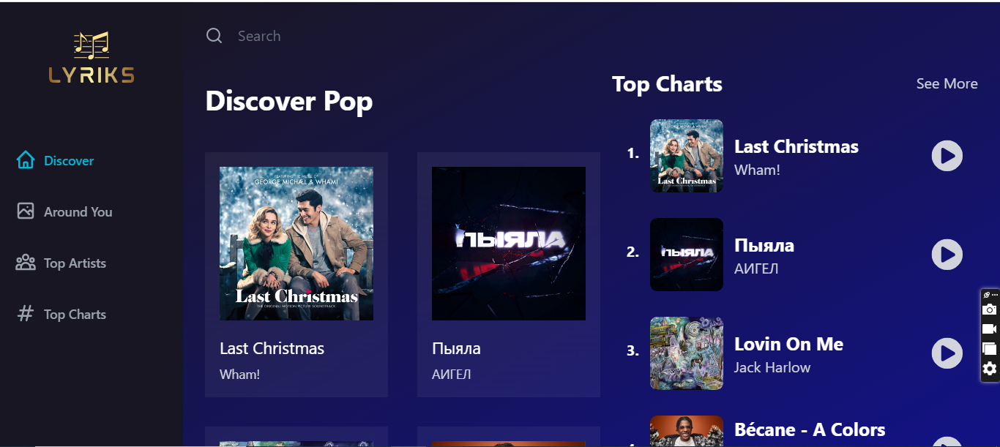

# Music App

## Table of Contents
- [Overview](#overview)
- [Features](#features)
- [Screenshots](#screenshots)
- [Tech Stack](#tech-stack)
- [What I Learned](#what-i-learned)
- [Continued Development](#continued-development)

## Overview
This project is a music discovery application that allows users to explore and interact with music in various ways.

## Features
- **Navigation:**
  - Users can navigate through different sections such as "Discover Around You," "Top Artists," and "Top Charts" using the sidebar.

- **Song Details:**
  - When a user taps on a song, the app provides detailed information about the selected song.

- **Responsiveness:**
  - The application is designed to be responsive and harmonious across all screen sizes.

## Screenshots

## Tech Stack
This project was built using the following technologies and libraries:

- [React](https://reactjs.org/): A JavaScript library for building user interfaces.
- [Redux](https://redux.js.org/): A predictable state container for JavaScript apps.
- [Tailwind CSS](https://tailwindcss.com/): A utility-first CSS framework for building modern designs.
- [Swiper](https://swiperjs.com/): A modern touch slider and framework with hardware-accelerated transitions.
- [RebidAPI](https://rebidapi.com/): An API service used for [describe the purpose, e.g., fetching song information, etc.].
- [Vite](https://vitejs.dev/): A fast development environment for modern web projects.

## What I Learned
- Implementing Redux for global state management.
- Passing data between components using React's `useParams`.

## Continued Development
- Explore advanced Redux patterns like middleware for asynchronous operations.
- Consider integrating additional APIs for more music-related data.
- Enhance user experience with animations and transitions.

